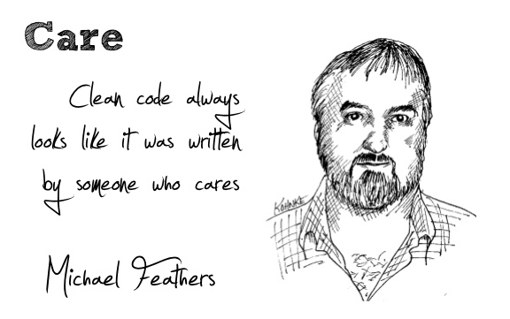

# DNA-Solver

<p align="">
    
    
    
</p>

A set of libraries and tools to create and test Genetic Algorithms experiments for combinatorial optimization problems.

With the [javascript](optimization) library and the [React.js GUI](client) it is possible to create and test Genetic Algorithms experiments with focus on hyperparametric optimization for solving the most common problems present in the combinatorial optimization literature.

The C++ implementation, on the other hand, is available [here](c-implementation), faster than the javascript one, but it not as flexible as the javascript implementation.

This project was developed under the context of the final work for the posgraduate course *"Advanced Techniques for Evolutionary Computation"*  by [Dr. Ignacio Ponzoni](https://cs.uns.edu.ar/~ip/) at [DCIC](https://cs.uns.edu.ar/~devcs/) (UNS).  

## Author's note

I hope the reader find this project helpful. I have not much knowledge in software architecture or design patterns, but my intention was to make readable code and a useful tool for those who are teaching or learning about Genetic Algorithms or Numerical Optimization Techniques. 



The main contribution of the library was written in javascript. This allows you to share the code through any medium and because its easy for someone to get access to an internet browser, almost every user will be able to run this code, on almost any smart device. Consider this as the only and most important advantage of this software, against other tools as Python or Matlab.

## Javascript

### Minimal JS example

Lets solve the [Subset Sum Problem](https://en.wikipedia.org/wiki/Subset_sum_problem) using this library. Here I'm using Node.js, but with a few adjustments, you can make it work on the browser too.

```js
import Ga from 'optimization/ga/index.mjs';
import SubsetSum from 'optimization/fitness/subsetsum.mjs';

// We're using the following numeric set of 20 elements
const set = [-96, -91, -87, -84, -82, -75, -71, -27, 12, 30, 46, 53, 73, 79, 80, 88, 90, 94, 94, 95];
const target = 0;

// We create the already implemented fitness model
const f = new SubsetSum(set, target);
// And the GA optimizer attached to this fitness model, configuring the mutation probability as 5%.
const ga = new Ga(f, {mut_prob: 0.05});

// Then, we run 100 generations
for(let gen = 0; gen < 100; gen++)
    ga.evolve();    

// Solution is in the first chromosome, as the population list is always sorted from best to worst
const solution = ga.population[0];

// Finally, we ṕrint results
process.stdout.write("Best subset: "+f.decode(solution.genotype)+"\n");
process.stdout.write("Objective value: "+solution.objective+"\n");
```

And the output will be something like:

```
Best subset: -87,-82,-75,30,46,80,88
Objective value: S = 0, N = 7
```

### Installation

Try the latest version [here](https://dna-solver.herokuapp.com/) or use this application locally running the following commands ([Node.js](https://nodejs.org/es/) already installed is required):  

```bash
$ git clone https://github.com/matiasmicheletto/dna-solver.git
$ cd dna-solver
$ npm install
$ npm run build
$ npm run start
```

If you need to use just the optimization module via scripting (without GUI), checkout the [examples](examples) folder and run the scripts installing the optimization package only (and cli-progress for this example, but not necessary), using the following commands:  

```bash
$ git clone https://github.com/matiasmicheletto/dna-solver.git
$ cd dna-solver
$ npm install cli-progress ./optimization
$ node examples/tsp/example_tsp_selection.mjs
```

### Getting started

This library provides a class to model any objective function with an interface to be optimized using Genetic Algorithms. Five class examples are provided to show how to extend this class in order to model common combinatorial optimization problems. The Ga class implements a Genetic Algorithm optimizer with many configuration options (see next section). Finally, the Experiment class allows to create and run different experiments to test the behaviour of GA optimizers when configuring different hyperparameters.


### Creating a custom Objective function model

To create a new Fitness model, extend the [prototype class](optimization/fitness/index.mjs), for example:

```js
export default class MyNewFitness extends Fitness {
    constructor(param1 = 1, param2 = 3) {
        // First we need to call the constructor of the parent class,
        // and pass the attributes or parameters:
        super({
          _param1: param1, 
          _param2: param2, 
          _name:"My new fitness model"
        });
        // Then we can use this._param1 or this._param2 as we need.
    }

    objective(x) {
        // This example just implements a simple linear function:
        return x * this._param1 + this._param2;
    }

    decode(g) {
      // Suppose we're using 16 bit BCD to decimal conversion.
      return parseInt(g.join("").slice(-16), 2);
    }
  
    objective_str(g) {
        // This function shows the result of evaluating the objective function
        // as a human-readable string.
        return "F("+g+")="+this.objective(this.decode(g));
    }

    eval(g) {
        // This is the fitness function. This function should return a numeric scalar
        // value that represents the solution's quality.
        return this.objective(this.decode(g));
    }

    rand_encoded() { 
        // As we're using binary strings, then the random solution generator will
        // return a random binary array with 16 bit length length:
        return new Array(16).fill(0).map(() => Math.round(Math.random()));
    }

    get ga_config() {
        // Lets say you don't want the user to know how to properly configure
        // the GA method to use your fitness model, so we can facilitate a
        // default configuration:
        return {
            pop_size: 50
            mut_prob: 0.01,
            cross_prob: 0.1,
            selection: selection.TOURNAMENT, // Remember to import "selection" from "ga"
            mutation: mutation.BITFLIP, // Remember to import "mutation" from "ga"
            tourn_k: 4 // As we're using tournament, we set the tournament size to 4
        };
    }
}
```

And thats it, now we can make our first experiment to see how does this behave (spoiler: will behave pretty bad, as its just a linear function):

```js
import Experiment from 'optimization/experiment/index.mjs';
import MyNewFitness from 'mynewfitness.mjs'

const experiment = new Experiment(); // Create the experiment manager
const f_id = experiment.add_fitness(MyNewFitness, [2, 8]); // Add our fitness with some parameters
experiment.add_ga(f_id); // Attach an optimizer to our fitness

// Run the experiment!
experiment.run({
  rounds:100, 
  iters:25, 
  progressCallback:p => process.stdout.write("Progress = "+p+"% \n")
});

// Ptint results:
process.stdout.write(experiment.getPlainResults());
```

### Configuring the GA optimizer

The following table shows the configuration parameters and default values used by the "Ga" class module to implement GA optimization.

| Parameter | Type | Default value | Description |
| --- | --- | --- | --- |
| `pop_size` | Integer number greater than 4 | `20` | Population size, number of chromosomes |  
| `elitism` | Integer number between 0 and `pop_size` | `2` | Number of elite individuals. Elite individuals are force-preserved through generations |  
| `selection` | `ROULETTE`, `RANK` or `TOURNAMENT` | `ROULETTE` | Selection operator enumerator |  
| `crossover` | `SINGLE`, `DOUBLE`, `CYCLE` or `PMX` | `SINGLE` | Crossover operator enumerator |  
| `mutation` | `BITFLIP`, `SWAP` or `RAND` | `BITFLIP` | Mutation operator enumerator |  
| `cross_prob` | Float number between 0 and 1 | `0.5` | Crossover probability (probability that a pair of selected individuals to be crossovered) |  
| `mut_prob` | Float number between 0 and 1 | `0.1` | Mutation probability (probability of an gen to change). Usually 1/(bitstring length) |  
| `rank_r` | Float number between 0 and `2/(pop_size*(pop_size-1))` | `0.002` | Ranking parameter (In case of ranking based selection). High r increases selective pressure |  
| `tourn_k` | Integer number between 2 and `pop_size` | `3` | K parameter for tournament selection method. Usually between 2 and 5 |  
| `best_fsw_factor` | Float number between 0 and 1 | `0.2` | Window size for getting evolution slope value proportional to generation number |  
| `param_control_enabled` | Boolean | `false` | Enable or disable the automatic parameter control |  
| `controlled_param` | `CROSS_PROB`, `MUT_PROB`, `RANK_R` or `TOURN_K` | `CROSS_PROB` | The controlled hyperparameter |  
| `param_control_factor` | Number | `0.01` | The incremental factor of the controller parameter |  
| `controller_var` | `GENERATION`, `POP_S2`, `EVOL_SLOPE` or `POP_AVG` | `GENERATION` | The controller variable (static control by default) |  


### Automatic parameter control

The last four parameters are used in automatic parameter control. There are two operation modes, static or adaptive. For static control, then `GENERATION` should be used as controller variable, then the controlled parameter will increment its value in `factor` (positive or negative) units on every generation until it reaches its maximum or minimum value. Otherwise, in the case of adaptive control, the controlled parameter will increase or decrease its value in `factor*value` units, where `value` is the numeric value of the controller variable, which can be `EVOL_SLOPE` (evolution slope), `POP_S2` (population variance) or `POP_AVG` (population average fitness).


### Using the GUI

A [React.js](https://reactjs.org/) and [Bootstrap](https://react-bootstrap.github.io/) GUI allows to build experiments graphically. There are two components that depend on the Fitness models, ["FitnessConfig"](client/src/components/fitnessconfig) and ["SolutionViewer"](client/src/components/solutionviewer). If not appropiate components are provided to configurate the model, then the FitnessConfig section will be displayed as a blank or empty space, and the SolutionViewer will show the solution vectors as dash-separated-element strings. Some ReactJS knowledge is required to code and include the components for a new Fitness model, but the ones provided will be helpful to understand the idea.


## C++ implementation

This implementation is the most recent and there is still work to be done. It fulfils a basic function and gives the users the possibility to easily modify its internal structure for adapting it to their needs. 

### Minimal C++ example

This example shows how to solve the [Subset Sum Problem](https://en.wikipedia.org/wiki/Subset_sum_problem).


```cpp
// Import other required libraries 
#include <iostream>
#include <vector>
#include <random>
#include "ga.h" // Adjust the path to the ga.h file

// We're using the following numeric set of 20 elements
std::vector<int> set = {-96, -91, -87, -84, -82, -75, -71, -27, 12, 30, 46, 53, 73, 79, 80, 88, 90, 94, 94, 95};

// We define the gene model, which consists of a binary string of 20 bits.

class BoolGene : public Gene {
    public:    
        BoolGene() : Gene() {
            randomize();
        }

        inline void randomize() override{
            digit = rand() % 2;
        }

        inline void print() const override {
            std::cout << digit << " ";
        }

        inline bool getValue() const {
            return digit;
        }

        inline void setValue(bool value) {
            digit = value;
        }

    private:
        bool digit;
};

// Then, we define the chromosome model. This chromosome will have 20 genes, each one representing a number in the set, where 1 means the number is selected and 0 means it is not.
class BinaryStringCh : public Chromosome {
    public:
        // The constructor of the parent class Chromosome requires as an argument the number of genes, because the mutation probability is set as 1/(number of genes).
        // The initialization of the gene vector is carried out in the child class constructor. In this case, we create a set of the previoulsy defined genes.
        BinaryStringCh(std::vector<unsigned int> *set) : Chromosome(set->size()) {
            this->set = set;
            unsigned int size = set->size();
            for (unsigned int i = 0; i < size; i++) {
                BoolGene *ig = new BoolGene();
                genes.push_back(ig);
            }
        }

        // The chromosome name is defined here and used mostly for debuggin purposes.
        std::string getName() const override {
            return "Subset selection array";
        }

        // The phenotype is information that is represented by the genes. In this case, each chromosome defines a sum value, depending on its genes values.
        unsigned int getPhenotype() const {
            unsigned int sum = 0;
            for (unsigned int i = 0; i < genes.size(); i++) {
                BoolGene *gene = (BoolGene*) genes[i];
                if (gene->getValue()) {
                    sum += set->at(i);
                }
            }
            return sum;
        }

        // The genotype is the representation of the phenotype, the print method allows to see what is the internal value of the chromosome, for example, when printing results.
        void printGenotype() const override {
            std::cout << "Genotype: ";
            for (Gene* gene : genes) {
                gene->print();
            }
            std::cout << std::endl;
        }

        // Printing the phenotype of a chromosome is useful to understand the solution found by the algorithm.
        void printPhenotype() const override {
            std::cout << "Phenotype: Subset = ";
            for (unsigned int i = 0; i < genes.size(); i++) {
                BoolGene *gene = (BoolGene*) genes[i];
                if (gene->getValue()) {
                    std::cout << set->at(i) << " ";
                }
            }
            std::cout << "- Sum = " << getPhenotype() << std::endl;
        }

        // The clone method allows to buld another chromosome with the same genes values.
        void clone(const Chromosome* other) {
            std::vector<Gene*> otherGenes = other->getGenes();
            // To access the child class methods, we need to cast the genes
            std::vector<Gene*> thisGenes = getGenes(); 
            for (unsigned int i = 0; i < otherGenes.size(); i++) {
                BoolGene *thisGene = dynamic_cast<BoolGene*>(thisGenes[i]);
                BoolGene *otherGene = dynamic_cast<BoolGene*>(otherGenes[i]);
                if (thisGene && otherGene) {
                    thisGene->setValue(otherGene->getValue());
                } else {
                    std::cerr << "Gene cast failed" << std::endl;
                }
            }
            fitness = other->fitness;
        }
    
    private:
        std::vector<unsigned int> *set;
};

// Finally, we define the fitness model. This model will evaluate the chromosome, giving a higher value to the best solutions.
class SubSetSumFitness : public Fitness {
    public:
        SubSetSumFitness(std::vector<unsigned int> *set, long int target) : Fitness() {
            this->set = set;
            this->target = target;
        }

        // The name of the fitness model is defined here.
        std::string getName() const override {
            return "Quadratic function";
        }
        
        // The following function is the core of the fitness model. It evaluates the chromosome and returns a numeric value that represents the quality of the solution. As it can be seen, the result is computed as: 
        // 100 / (abs(error) + 1) - sizeCost
        // where error is the difference between the target value and the sum of the selected numbers, and sizeCost is the proportion of selected numbers in the chromosome.
        // This minimizes the error between the subset sum and the target value, and at the same time, it tries to minimize the number of selected numbers.
        double evaluate(const Chromosome *chromosome) const override {
            BinaryStringCh *c = (BinaryStringCh*) chromosome;
            unsigned int subSetSize = 0;
            for(unsigned int i = 0; i < set->size(); i++){
                BoolGene *gene = (BoolGene*) c->getGenes()[i];
                if(gene->getValue()){
                    subSetSize++;
                }
            }
            const long int error = (long int)c->getPhenotype() - (long int)target;
            const double sizeCost = (double)subSetSize/(double)set->size();
            return abs(100.0 / ((double) abs(error) + 1.0) - sizeCost);
        }

        // The chromosome generator is defined here. It returns a new chromosome with random genes values. This method is defined here because the fitness model knows the chromosome structure, and the genetic algorithm need to generate new chromosomes at the initialization process.
        BinaryStringCh* generateChromosome() const override {
            BinaryStringCh *ch = new BinaryStringCh(set);
            ch->fitness = evaluate(ch);
            return ch;
        }
    
    private:
        std::vector<unsigned int> *set;
        unsigned int target;
};

int main(int argc, char **argv) {
    
    // We create the already implemented fitness model
    SubSetSumFitness f(&set, 0);
    GeneticAlgorithm ga(&f, 0.05);
    
    // The genetic algorithm requires the fitness function to construct the object.
    GeneticAlgorithm *ga = new GeneticAlgorithm(f);
    
    // The library provides a method to configure the genetic algorithm. This method receives the command line arguments and sets the parameters of the genetic algorithm.
    // Check the manual.txt file to see the available parameters.
    // There is an overloaded setConfig function that takes a GAConfig object with all the configuration parameters. If the setConfig function is not called, the genetic algorithm will use the default parameters.
    ga->setConfig(argc, argv);

    // The print function displays the configuration of the genetic algorithm.
    ga->print();

    // The run function executes the genetic algorithm and returns the best solution found.
    GAResults results = ga->run();

    // The print function displays the results of the genetic algorithm.
    results.print();

    delete ga;

    return 0;
}
```

---

Author: [Matías Micheletto](matiasmicheletto.github.io) - [matias.micheletto@uns.edu.ar](mailto:matias.micheletto@uns.edu.ar)  
ICIC - CONICET - UNS  
License: GPL-3.0

---

## Backlog

Module development (100%).  
- [x] Fitness function module (100%). 
    - [x] Parabola.  
    - [x] Subset sum problem.  
    - [x] N-Queens problem.  
    - [x] TSP Problem.  
- [x] Optimizer module (100%).  
    - [x] Fitness model configuratinon.  
    - [x] Population size and elitism configuration.  
    - [x] Configuration of selection operators.  
    - [x] Configuration of crossover operators.  
    - [x] Configuration of mutation operators.  
    - [x] Termination criteria (fixed to generations number).  
    - [x] Parameter control (static and adaptive).  
- [x] Experiment manager module (100%).  
    - [x] Fitness modules lists management.  
    - [x] Optimizers list management.  
    - [x] Optimizers duplication.  
    - [x] Fitness and optimizers configuration.  
    - [x] Experiment execution.  
    - [x] Result summarization.  
- [x] Command line optimization example scripts (100%).  
    - [x] Example 1: Simple TSP. Experiment configuration.  
    - [x] Example 2: NQueens. Multiple fitness experiment.  
    - [x] Example 3: Complex TSP. Parameter tunning.  
- [x] Export results as plain text file (100%).  
- [x] Generate NodeJS module (100%).  

GUI development (100%)  
- [x] Graphical experiment configuration (100%).  
  - [x] Add and remove fitness models.  
  - [x] Add and remove optimizers.  
- [x] Graphical fitness model configuration (100%).  
  - [x] Problem description.  
  - [x] Parameter configuration.  
- [x] Graphical optimizer configuration (100%).  
  - [x] Static parameters configuration.  
  - [x] Name edition.  
  - [x] Adaptive/static parameter configuration.  
- [x] Graphical experiment control (100%).  
  - [x] Run and reset buttons.  
  - [x] Iterations and rounds configuration.  
  - [x] Timeout configuration.   
- [x] Graphical experiment output (100%).  
  - [x] Experiment results summary.  
  - [x] Solution evolution history.  
  - [x] Optimizers comparative bar plot.  
- [x] Solution candidate visualization (100%).  
  - [x] Quadratic function plot.  
  - [x] Chess board for N-Queens.  
  - [x] TSP destinations map.  
