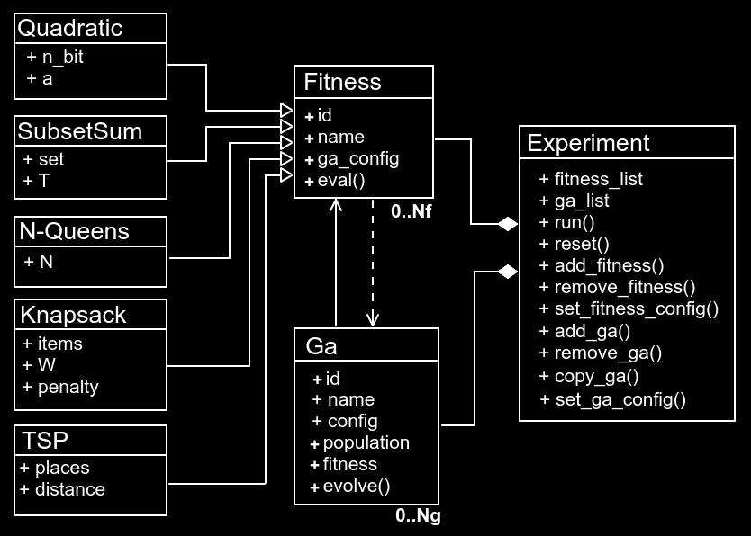
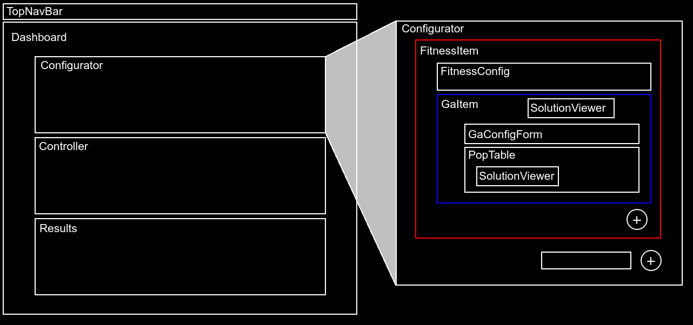

# DNA-Solver

<p align="">
    
    
    
</p>

A [Node.js module](optimization) and a [React.js GUI](client) that allows to create and test Genetic Algorithms experiments with focus on hyperparametric optimization for solving the most common problems present in the combinatorial optimization literature.

This project was developed under the context of the final work for the posgraduate course *"Advanced Techniques for Evolutionary Computation"*  by [Dr. Ignacio Ponzoni](https://cs.uns.edu.ar/~ip/) at [DCIC](https://cs.uns.edu.ar/~devcs/) (UNS).  


## Minimal example

Lets solve the [Subset Sum Problem](https://en.wikipedia.org/wiki/Subset_sum_problem) using this library:

```js
import Ga from 'optimization/ga/index.mjs';
import SubsetSum from 'optimization/fitness/subsetsum.mjs';

// We're using the following numeric set of 20 elements
const set = [-96, -91, -87, -84, -82, -75, -71, -27, 12, 30, 46, 53, 73, 79, 80, 88, 90, 94, 94, 95];
const target = 0;

// We create the already implemented fitness model
const f = new SubsetSum(set, target);
// And the GA optimizer attached to this fitness model, configuring the mutation probability as 5%.
const ga = new Ga(f, {mut_prob: 0.05});

// Then, we run 100 generations
for(let gen = 0; gen < 100; gen++)
    ga.evolve();    

// Solution is in the first chromosome, as the population list is always sorted from best to worst
const solution = ga.population[0];

// Finally, we ṕrint results
process.stdout.write("Best subset: "+f.decode(solution.genotype)+"\n");
process.stdout.write("Objective value: "+solution.objective+"\n");
```

And the output will be something like:

```
Best subset: -87,-82,-75,30,46,80,88
Objective value: S = 0, N = 7
```

## Installation

Try the latest version [here](https://dna-solver.herokuapp.com/) or use this application locally running the following commands ([Node.js](https://nodejs.org/es/) already installed is required):  

```bash
$ git clone https://github.com/matiasmicheletto/dna-solver.git
$ cd dna-solver
$ npm install
$ npm run build
$ npm run start
```

If you need to use just the optimization module via scripting (without GUI), checkout the [examples](examples) folder and run the scripts installing the optimization package only (and cli-progress for this example, but not necessary), using the following commands:  

```bash
$ git clone https://github.com/matiasmicheletto/dna-solver.git
$ cd dna-solver
$ npm install cli-progress ./optimization
$ node examples/tsp/example_tsp_selection.mjs
```

## Getting started

This library provides a class to model any objective function with an interface to be optimized using Genetic Algorithms. Five class examples are provided to show how to extend this class in order to model common combinatorial optimization problems. The Ga class implements a Genetic Algorithm optimizer with many configuration options (see next section). Finally, the Experiment class allows to create and run different experiments to test the behaviour of GA optimizers when configuring different hyperparameters.



## Creating a custom Objective function model

To create a new Fitness model, extend the [prototype class](optimization/fitness/index.mjs), for example:

```js
export default class MyNewFitness extends Fitness {
    constructor(param1 = 1, param2 = 3) {
        // First we need to call the constructor of the parent class,
        // and pass the attributes or parameters:
        super({
          _param1: param1, 
          _param2: param2, 
          _name:"My new fitness model"
        });
        // Then we can use this._param1 or this._param2 as we need.
    }

    objective(x) {
        // This example just implements a simple linear function:
        return x * this._param1 + this._param2;
    }

    decode(g) {
      // Suppose we're using 16 bit BCD to decimal conversion.
      return parseInt(g.join("").slice(-16), 2);
    }
  
    objective_str(g) {
        // This function shows the result of evaluating the objective function
        // as a human-readable string.
        return "F("+g+")="+this.objective(this.decode(g));
    }

    eval(g) {
        // This is the fitness function. This function should return a numeric scalar
        // value that represents the solution's quality.
        return this.objective(this.decode(g));
    }

    rand_encoded() { 
        // As we're using binary strings, then the random solution generator will
        // return a random binary array with 16 bit length length:
        return new Array(16).fill(0).map(() => Math.round(Math.random()));
    }

    get ga_config() {
        // Lets say you don't want the user to know how to properly configure
        // the GA method to use your fitness model, so we can facilitate a
        // default configuration:
        return {
            pop_size: 50
            mut_prob: 0.01,
            cross_prob: 0.1,
            selection: selection.TOURNAMENT, // Remember to import "selection" from "ga"
            mutation: mutation.BITFLIP, // Remember to import "mutation" from "ga"
            tourn_k: 4 // As we're using tournament, we set the tournament size to 4
        };
    }
}
```

And thats it, now we can make our first experiment to see how does this behave (spoiler: will behave pretty bad, as its just a linear function):

```js
import Experiment from 'optimization/experiment/index.mjs';
import MyNewFitness from 'mynewfitness.mjs'

const experiment = new Experiment(); // Create the experiment manager
const f_id = experiment.add_fitness(MyNewFitness, [2, 8]); // Add our fitness with some parameters
experiment.add_ga(f_id); // Attach an optimizer to our fitness

// Run the experiment!
experiment.run({
  rounds:100, 
  iters:25, 
  progressCallback:p => process.stdout.write("Progress = "+p+"% \n")
});

// Ptint results:
process.stdout.write(experiment.getPlainResults());
```

## Configuring the GA optimizer

The following table shows the configuration parameters and default values used by the "Ga" class module to implement GA optimization.

| Parameter | Type | Default value | Description |
| --- | --- | --- | --- |
| `pop_size` | Integer number greater than 4 | `20` | Population size, number of chromosomes |  
| `elitism` | Integer number between 0 and `pop_size` | `2` | Number of elite individuals. Elite individuals are force-preserved through generations |  
| `selection` | ROULETTE, RANK or TOURNAMENT | `ROULETTE` | Selection operator enumerator |  
| `crossover` | SINGLE, DOUBLE, CYCLE or PMX | `SINGLE` | Crossover operator enumerator |  
| `mutation` | BITFLIP, SWAP or RAND | `BITFLIP` | Mutation operator enumerator |  
| `cross_prob` | Float number between 0 and 1 | `0.5` | Crossover probability (probability that a pair of selected individuals to be crossovered) |  
| `mut_prob` | Float number between 0 and 1 | `0.1` | Mutation probability (probability of an gen to change). Usually 1/(bitstring length) |  
| `mut_gen` | Function | `()=>Math.round(Math.rand())` | The gen generator function used in mutation |  
| `rank_r` | Float number between 0 and `2/(pop_size*(pop_size-1))` | `0.002` | Ranking parameter (In case of ranking based selection). High r increases selective pressure |  
| `tourn_k` | Integer number between 2 and `pop_size` | `3` | K parameter for tournament selection method. Usually between 2 and 5 |  
| `best_fsw_factor` | Float number between 0 and 1 | `0.2` | Window size for getting evolution slope value proportional to generation number |  
| `param_control_enabled` | Boolean | `false` | Enable or disable the automatic parameter control |  
| `controlled_param` | Parameter name as String | `CROSS_PROB` | The controlled hyperparameter |  
| `param_control_factor` | Number | `0.01` | The incremental factor of the controller parameter |  
| `controller_var` | Variable name as String | `GENERATION` | The controller variable (static control by default) |  

### Automatic parameter control

The last four parameters are used in automatic parameter control. There are two operation modes, static or adaptive. For static control, then `GENERATION` should be used as controller variable, then the controlled parameter will increment its value in `factor` (positive or negative) units on every generation until it reaches its maximum or minimum value. Otherwise, in the case of adaptive control, the controlled parameter will increase or decrease its value in `factor*value` units, where `value` is the numeric value of the controller variable, which can be `EVOL_SLOPE` (evolution slope), `POP_S2` (population variance) or `POP_AVG` (population average fitness).


## Using the GUI

A [React.js](https://reactjs.org/) and [Bootstrap](https://react-bootstrap.github.io/) GUI allows to build experiments graphically. There are two components that depend on the Fitness models, ["FitnessConfig"](client/src/components/fitnessconfig) and ["SolutionViewer"](client/src/components/solutionviewer). If not appropiate components are provided to configurate the model, then the FitnessConfig section will be displayed as a blank or empty space, and the SolutionViewer will show the solution vectors as dash-separated-element strings. Some ReactJS knowledge is required to code and include the components for a new Fitness model, but the ones provided will be helpful to understand the idea.



---

Author: [Matías Micheletto](matiasmicheletto.github.io) - [matias.micheletto@uns.edu.ar](mailto:matias.micheletto@uns.edu.ar)  
ICIC - CONICET - UNS  
License: GPL-3.0

---

## Backlog

Module development (93%).  
- [x] Fitness function module (100%). 
    - [x] Parabola.  
    - [x] Subset sum problem.  
    - [x] N-Queens problem.  
    - [x] TSP Problem.  
- [x] Optimizer module (100%).  
    - [x] Fitness model configuratinon.  
    - [x] Population size and elitism configuration.  
    - [x] Configuration of selection operators.  
    - [x] Configuration of crossover operators.  
    - [x] Configuration of mutation operators.  
    - [x] Termination criteria (fixed to generations number).  
    - [x] Parameter control (static and adaptive).  
- [x] Experiment manager module (100%).  
    - [x] Fitness modules lists management.  
    - [x] Optimizers list management.  
    - [x] Optimizers duplication.  
    - [x] Fitness and optimizers configuration.  
    - [x] Experiment execution.  
    - [x] Result summarization.  
- [x] Command line optimization example scripts (100%).  
    - [x] Example 1: Simple TSP. Experiment configuration.  
    - [x] Example 2: NQueens. Multiple fitness experiment.  
    - [x] Example 3: Complex TSP. Parameter tunning.  
- [x] Export results as plain text file (100%).  
- [x] Generate NodeJS module (100%).  

GUI development (100%)  
- [x] Graphical experiment configuration (100%).  
  - [x] Add and remove fitness models.  
  - [x] Add and remove optimizers.  
- [x] Graphical fitness model configuration (100%).  
  - [x] Problem description.  
  - [x] Parameter configuration.  
- [ ] Graphical optimizer configuration (66%).  
  - [x] Static parameters configuration.  
  - [x] Name edition.  
  - [x] Adaptive/static parameter configuration.  
- [x] Graphical experiment control (100%).  
  - [x] Run and reset buttons.  
  - [x] Iterations and rounds configuration.  
  - [x] Timeout configuration.   
- [x] Graphical experiment output (100%).  
  - [x] Experiment results summary.  
  - [x] Solution evolution history.  
  - [x] Optimizers comparative bar plot.  
- [x] Solution candidate visualization (100%).  
  - [x] Quadratic function plot.  
  - [x] Chess board for N-Queens.  
  - [x] TSP destinations map.  
